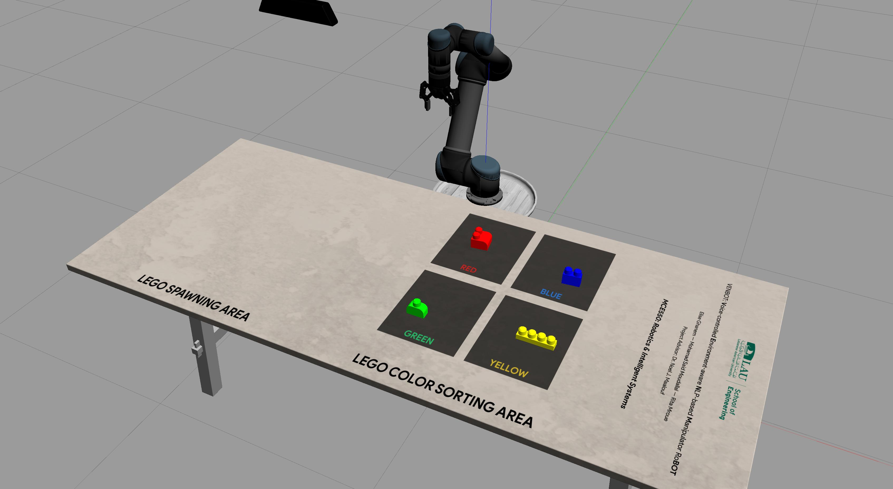
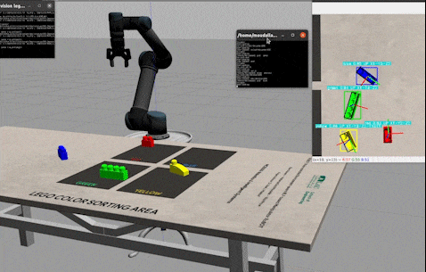
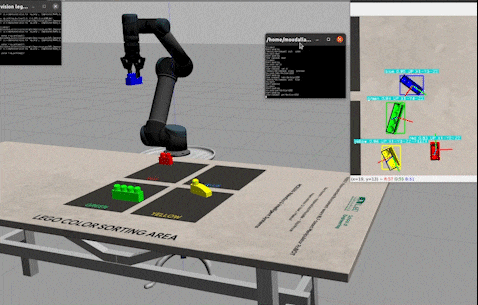
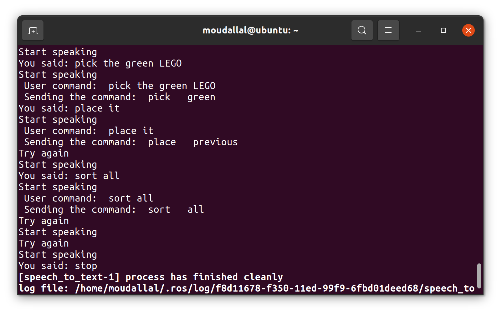

<p align="center">
  
</p>

# VENBOT: A <i>V</i>oice-controlled <i>E</i>nvironment-aware <i>N</i>LP-based Manipulator Ro<i>BOT</i>
This repository contains the files for MCE550's Final Project. You can find a description of the MCE550 course [here](https://soe.lau.edu.lb/departments/mechatronics/degree-programs/mechatronic-courses.php#MCE550).

## Overview
Inspired by the intersectionality and versatility of robotics, VENBOT is the product of our experimentation with ROS and Natural Language Processing (NLP).
This project relies on both NLP and computer vision in order to sort different Lego bricks according to their color and based on the command that the user or operator sends through speech. 

The goals of this project can be found in the following list.
- Simulate pick-and-place environment with a UR5 manipulator and suitable gripper to account for the different types and sizes of Lego bricks
- Implement computer vision through a fixed camera for recognizing objects, estimating their pose, and providing their color
- Develop voice recognition code that converts user vocal input to text which is continuously displayed for convenience and feedback
- Perform speech segmentation and processing using NLP by associating the recorded text to pick and place commands while accounting for synonyms and invalid requests
- Develop an interface for performing the processed robot commands in real-time

Refer to [project_proposal.pdf]() and [project_report.pdf]() for more information regarding the VENBOT.

<p align="center">
  
  
</p>

## Installation
In order to successfully run all functionalities of this assignment, you should have ROS Noetic and Gazebo 7 installed.

### Requirements

- `ROS Noetic:` http://wiki.ros.org/noetic/Installation
- `Gazebo:` https://classic.gazebosim.org/tutorials?tut=ros_installing&cat=connect_ros
- `Yolov5` https://github.com/ultralytics/yolov5
- `Catkin` https://catkin-tools.readthedocs.io/en/latest/
- `Spacey` https://spacy.io/usage 
- `Speech Recognition` https://pypi.org/project/SpeechRecognition/

After installing the mentioned libraries, move through the following steps.

#### 1. Clone this repository

```sh
$ cd ~
$ git clone https://github.com/moudallal/venbot
```

#### 2. Clone and install [YoloV5](https://github.com/ultralytics/yolov5)

```sh
$ cd ~
$ git clone https://github.com/ultralytics/yolov5
$ cd yolov5
$ pip3 install -r requirements.txt
```

#### 3. Grant execution rights for `.py` and `.sh` files

```sh
$ cd ~/venbot
$ sudo chmod +x *.py
$ sudo chmod catkin_ws/src/scripts/launch.sh
```

#### 4. Build your workspace and source your environment

```sh
$ cd ~/venbot/catkin_ws
$ catkin build
$ source devel/setup.bash
```

## Usage
If all of the above steps were completed successfully, you can continue to use the source code you just installed.

#### 1. Launch the main script
```sh
$ cd ~/venbot/catkin_ws/src/scripts
$ ./launch.sh
```

#### 2. Wait for the all the terminals to launch properly

#### 3. Start giving commands! The available commands can be found below.

<p align="center">
  
</p>

- pick the [color] lego 
- take the [color] lego
- grasp the [color] lego
- collect the [color] lego
- place it
- set it
- place it in [color]
- sort
- sort all
- stop

## Credits
| Name                    | GitHub                                |
|-------------------------|---------------------------------------|
| Elise Ghanem            | https://github.com/eliseghanem        |
| Mohamad Said Moudallal  | https://github.com/moudallal          |
| Rita Mroue              | https://github.com/ritamroue          |

A special thanks to the team from University of Trento that developed the backbone of our project by implementing the UR5 along with the vision and manipulation functionality.\
Their original work can be found [here](https://github.com/pietrolechthaler/UR5-Pick-and-Place-Simulation).
